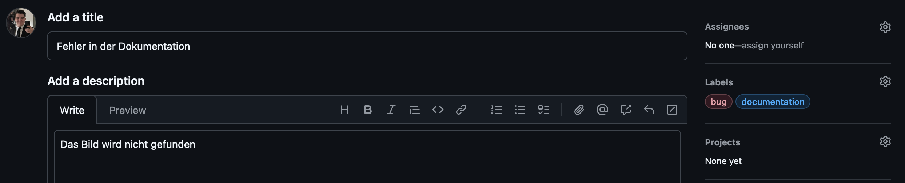
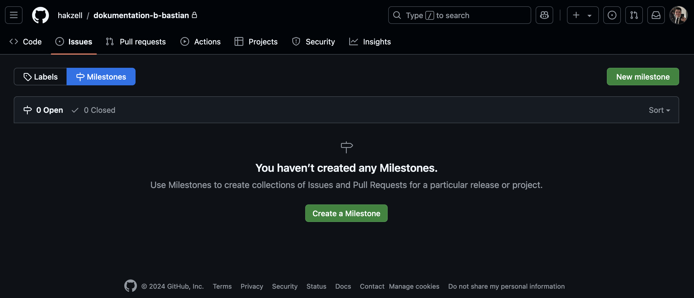
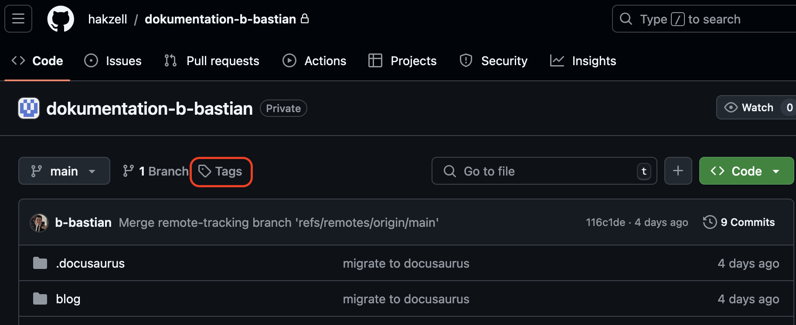
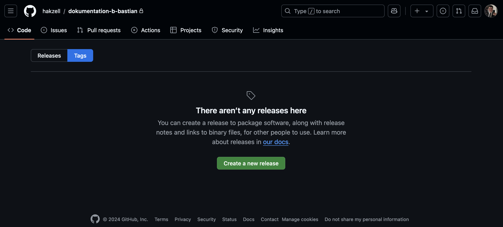
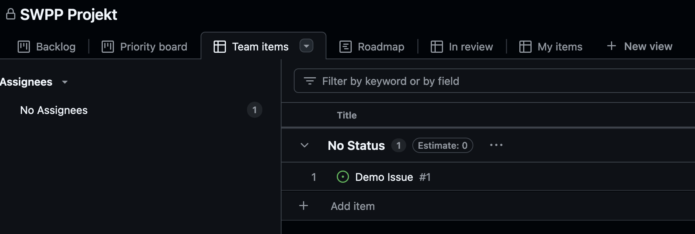
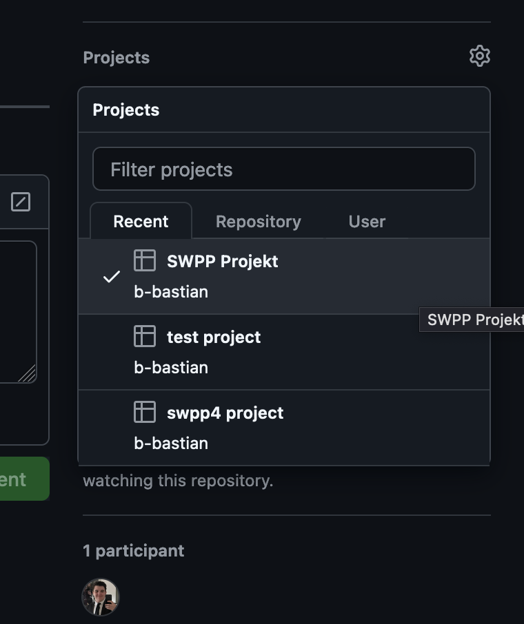
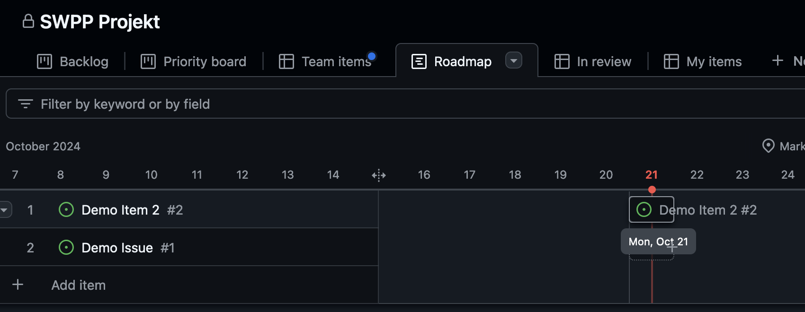

# Arbeit mit GitHub

## Allgemeines

GitHub eignet sich optimal zur Projektverwaltung. Es bietet

<!-- truncate -->

- Verwaltung von Issues,
- Meilensteine,
- Tags, um Veröffentlichungen zu kennzeichnen,
- Branches und
- Projektverwaltung
  - Roadmaps
  - Kanban
  - Workflows (automatische Veränderung von Issues)

## Verwaltung von Issues

Fehler oder Verbesserungsvorschläge können im Repository gemeldet werden. Die Issues können mit Labels gekennzeichnet werden.



Um die Erstellung der Issues besser organisieren zu können, können **Templates** verwendet werden:

```yml
name: Bug report
description: Fill out a bug report to help us improve Statamic.
body:
  - type: textarea
    attributes:
      label: Bug description
      description: What happened? What did you expect to happen? Feel free to drop any screenshots in here.
      placeholder: I did this thing over here, and saw this error...
    validations:
      required: true
```

:::note
Die Templates werden im Repository im Ordner `.github/ISSUE_TEMPLATE` als `name.yml`gespeichert.
:::

## Commits

Bei der laufenden Arbeti werden regelmäßig `Commits` erstellt. Dadurch können bei Bedarf Schritte schnell rückgängig gemacht werden. `Commits` müssen eine sinnvolle Zusammenfassung der Veränderungen liefern. Es werden immer die aktuell `gestagten`(- Dateien, welche mit `git add .` oder mit `git add [FILENAME]` hinzugefügt wurden) Dateien mit einem `Commit` gespeichert. Die Dateien in einem `Commit` sollen "logisch zusammenhängen". Eine kurze `Commit`-Nachricht wird mittels Parameter `-m` direkt angegeben (`git commit -m "add heading to text"`).

Commits-Nachrichten könnten zum Beispiel folgendermaßen lauten:

- add heading to text
- remove section from dashboard
- hide author in editor panel

Soll mit einer `Commit`-Nachricht auch gleichzeitig ein Issue geschlossen werden, so kann dies in der `Commit`-Nachricht direkt mittels z.B. `close #2` (2 ist dabei die Issue-Nummer) festgelegt werden. Eine entsprechende Nachricht könnte folgendermaßen aussehen:

- add heading to text and **close #2**

Es werden mehrere Schlüsselwörter von GitHub unterseützt (z.B. auch `fix`).

Lange `Commit`-Nachrichten beinhalten eine kurze Zusammenfassung in der ersten Zeile des `Commits` und gefolgt nach einer Leerzeile erfolgt eine längere Beschreibung.

:::note
Eine längere `Commit`-Nachricht wird mittels `git commit `abgesendet.
:::

```
add heading to text

Lorem, ipsum dolor sit amet consectetur adipisicing elit. Officiis harum cupiditate facilis voluptate ducimus quia, provident, eaque amet, asperiores dolorum adipisci iste consequatur ullam quo officia ad rem dolore ipsam!
```

Standardmäßig öffnet sich bei `git commit`der `vi` bzw. `vim`. Dieser Editor wird in der Eingabeaufforderung (Mac: Terminal) verwendet. Folgende Befehle erlauben eine Textbearbeitung:

- `i`: mit `i` wird in einen `insert mode` gewechselt und es kann ein Text eingegebn werden.
- `esc`: mit `esc` wird der `insert mode` verlassen und es können weitere Befehle eingegeben werden.
- `:wq`: der Befehl `w` bedeutet "write", "schreiben" und `q` "quit", "beenden"

:::note
Im Editor können die `Cursor`-Tasten verwendet werden. Weiters werden noch viele andere Befehle unterstützt.
:::

## Meilensteine

Um besondere Abschnitte in der Softwareerstellung zu kennzeichnen und Termine zu fixieren, werden **Meilensteine** eingesetzt.



Issues weren zu Meilensteinen hinzugefügt und deren Status (offen, geschlossen) wird in der Fortschrittanzeige des Meilensteins berücksichtigt.

## Tags

Mit Tags werden Versionen gekennzeichnet. Diesbezüglich wird `Semantic Versioning` eingesetzt. Dies bedeutet, das ein Tag zum Beispiel mit dem Namen v1.2.0 erstellt wird. Der erste Abschnitt (v**1**.2.0) kennzeichnet die Hauptversion, der zweite Bereich (v1.**2**.0) kennzeichnet den Feature-Stand und der dritte Bereich (v1.2.**0**) wird bei einer Aktualisierung der Software erhöht.

Falls nur der letzte (dritte) Bereich verändert wird, so handelt es sich zum Beispiel um einen Bugfix - der Bugfix kann im Regelfall ohne vorherige Prüfung (abhängig von der Sicherheitsstufe) installiert werden.

Wird der zweite Bereich erhöht, so wurde zum Beispiel die Software mit einem zusätzlichen Feature ausgestattet - auch diese Installation sollte ohne Probleme vorgenommen werden können.

Wird der erste Bereich der Softwareversion erhöht, so handelt es sich um ein Upgrade - die deutet auf eine massive Änderung der Software hin. Die Software muss nicht mehr kompatibel zur vorherigen Installation sein.

In Git werden Tags mit `git tag v.1.2.0` erstellt. Die bestehenden Tags können mit dem Befehl `git tag` angezeigt werden. In der Github-Oberfläche werden diese Tags neben den Branches angezeigt.





:::tip
Eine Software sollte vor einem Release immer getaggt werden, da dadurch der Softwareastand besser ersichtlich ist und auch Probleme mit der Software besser überprüfbar sind.
:::

## Branches

An einem Git-Projekt können mehrere Personen beteiligt sein. Die Arbeit erfolgt in mehreren Zweigen. In der folgenden Grafik ist ersichtlich, dass ein `main`-Zweig immer eine funktionierende Version aufweist. Ein `hotfix`-Zweig wird für schnelle Bugfixes verwendet. Die Entwicklung erfolgt in einem `develop`-Zweig und die einzelnen Features werden in `feature`-Zweige entiwckelt.

Durch die Verwendung von `branches` können Fehler rasch zurückgesetzt werden und das Team wird durch fehlerhafte oder noch nicht fertig gestellte Funktionen nicht gestört.

[^1]

Die Erstellung eines `branches` erfolgt mittens `git checkout -b [ZWEIGNAME]`. Mit diesem Befehl wird der Zweig auch automatisch "ausgecheckt". Ansonsten kann mit der Angabe eines "Branches" der gewünschte Zweig angegeben werden (z.B. `git checkout main`).

Im aktuellen Zweig (Anzeige mit `git branch -v` - der aktuelle Zweig weist einen `*` auf) werden laufend `Commits` durchgeführt. Anschließend wird in den "Ziel-Zweig" mit `git checkout` gewechselt und ein `git merge [ZWEIGNAME]` durchgeführt. Damit landen die `Commits` im Zielzweig. Der ursprüngliche Zweig darf nach diesem Merge gelöscht werden.

:::danger
Falls nach einem `Checkout` der ursprüngliche Zweig verändert wurde, kann es bei einem `Merge` zu Konflikten kommen. Diese Konflikte **müssen korrigiert** werden. Anschließend erfolgt ein `commit` mit den korrigierten Dateien.  
:::

:::tip
Auf der Website [https://learngitbranching.js.org/](https://learngitbranching.js.org/) kann das Branching selbstständig geübt werden.
:::

## Projekte

Ein Projekt erlaubt in GitHub weitere Ansichten auf `Issues`. Mit einem **Kanban** können Karteikarten verwendet werden. Diese Karten können je nach Status eine bessere Übersicht über die zu erledigenden "ISsues" liefern. Mit **Workflows** kann festgelegt werden, dass "Issues" in der Spalte z.B. "done" landen, wenn sie mit einem `commit` geschlossen wurden.

Die **Roadmap** ermöglicht die Anzeige von "Meilensteinen" und erlaubt die Zuweisung von "Start-" und "Endzeitpunkten". Dadurch wird die zeitliche Abfolge der Issues besser dargstellt. Die Anzeige erfolgt in einem `Gantt-Chart`.





Ein Issue muss immer mit dem PRojekt verbunden werden bzw. kann auch in der Roadmap ein Issue erstellt und konvertiert werden.



Um ein "Gantt" anzuzeigen, müssen die Datumfelder festgelegt werden.

[^1]: **Hoang**. Git Workflow Action. URL: https://github.com/marketplace/actions/gitflow-workflow-action, Datum: 25. Oktober 2024
