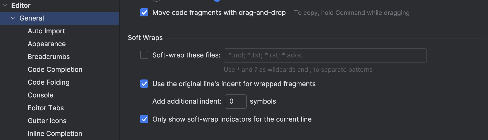

# Zeilenumbruch in PhpStorm

Im Dateimenü auf `View > Active Editor > Soft Wrap` geklickt um einen Zeilenumbruch zu erhalten. (Mac `Preferences/Settings > Editor > General > Soft-wrap files`)

<!-- truncate -->

Softwrap in VS Code (Mac)

oder ⌘-Z
