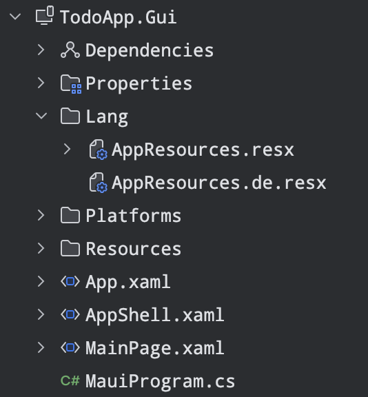
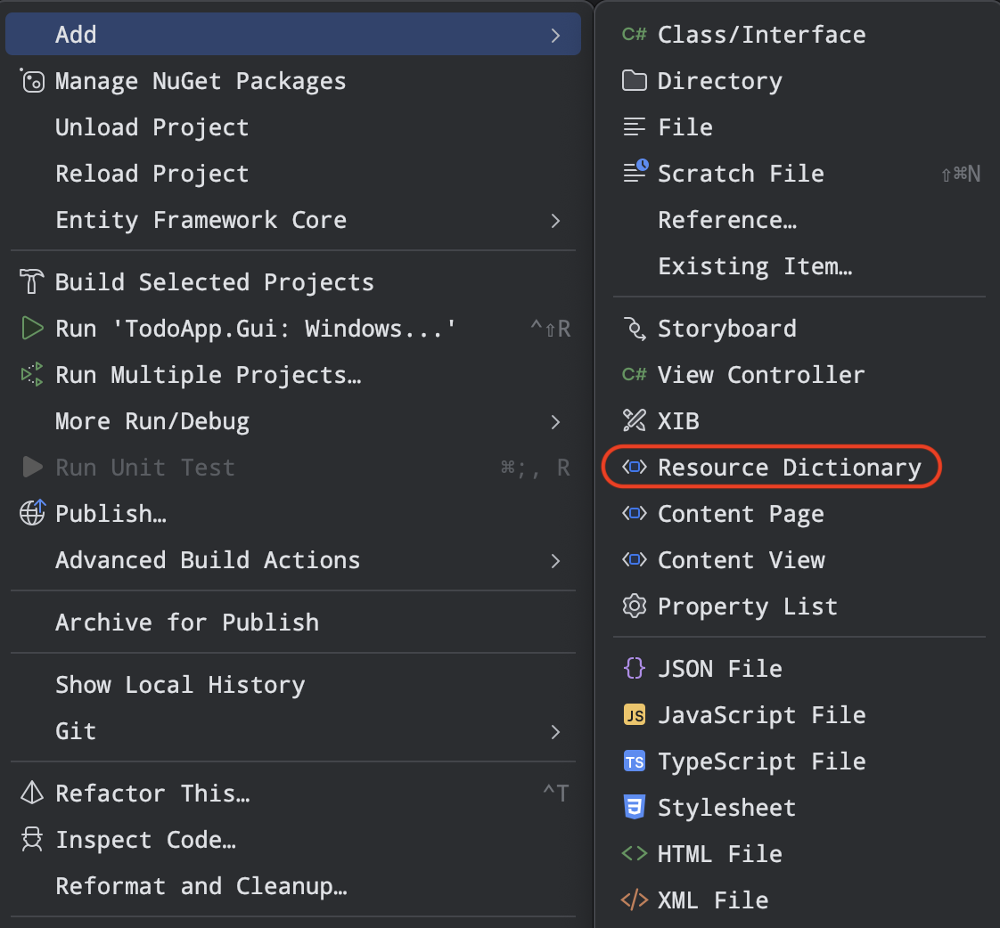
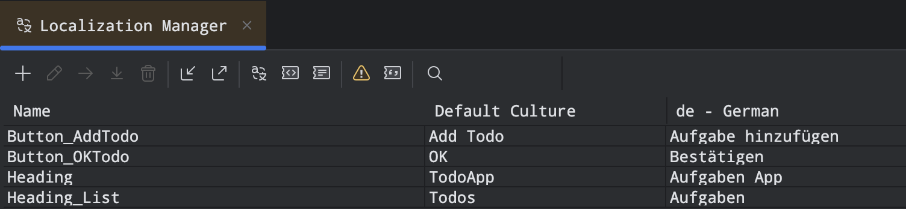

# Lokalisierung

Um eine _.NET MAUI_-App zu lokalisieren (= übersetzen) werden Ressourcen-Dateien benötigt. In einem Ordner namens z.B. `Resources > String` wird eine `AppResources.resx` erstellt. In dieser Datei werden die englischen Bezeichnungen erfasst (Fallback-Language).

<!-- truncate -->



Die Ressourcen werden folgerndermaßen hinzugefügt:



:::tip
Als **Fallback-Language** bezeichnet man die Standardsprache, die verwendet wird, wenn eine bestimmte Übersetzung eines Wortes nicht verfügbar ist.
:::

In einer _ContentPage_ (z.B. `MainPage.xaml`) wird der Namespace zu _Strings_ hinzugefügt:

```xml
xmlns:resx="clr-namespace:TodoApp.Gui.Lang"
```

wird in der `MainPage.xaml` folgendermaßen hinzugefügt:

```xml
<ContentPage xmlns="http://schemas.microsoft.com/dotnet/2021/maui"
             xmlns:x="http://schemas.microsoft.com/winfx/2009/xaml"
             xmlns:viewmodels="clr-namespace:TodoApp.Core.ViewModels;assembly=TodoApp.Core"
             x:DataType="viewmodels:MainViewModel"
             xmlns:models="clr-namespace:TodoApp.Core.Models;assembly=TodoApp.Core"
             xmlns:toolkit="http://schemas.microsoft.com/dotnet/2022/maui/toolkit"
             xmlns:resx="clr-namespace:TodoApp.Gui.Lang"
             x:Class="TodoApp.Gui.MainPage">

</ContentPage>
```

Die Text werden schließlich in der Ressourcen-Datei und in der `XAML`-Datei folgendermaßen hinzugefügt:



```xml
<Label Text="{x:Static resx:AppResources.Heading}" FontSize="Header" />
```
