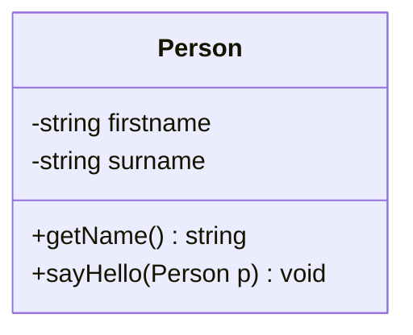

# Klassendiagramm

Klassendiagramme können schnell mittels _Mermaid_ erstellt werden. Mermaid wird auch von GitHub unterstützt.

<!-- truncate -->

Ein Live-Editor ist uner https://mermaid.live verfügbar.

