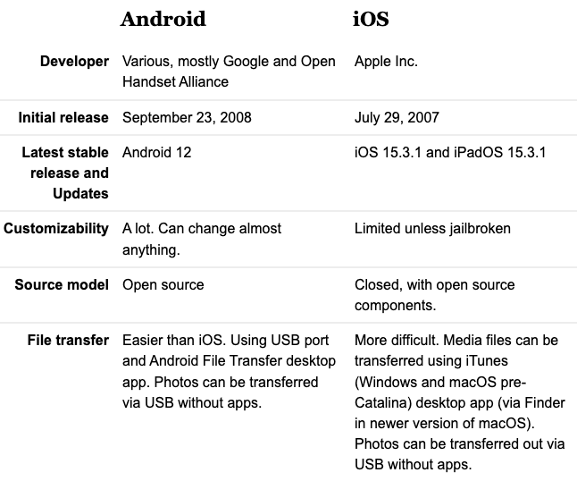
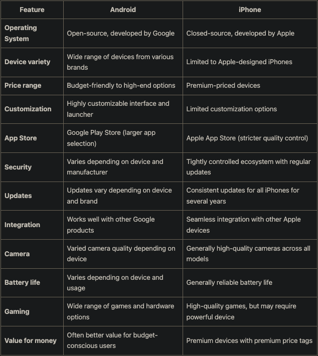

# Alternativen bewerten

Wenn bei einem Projekt mehrere Alternativen zur Auswahl stehen, müssen die Alternativen mit bestimmten Kriterien bewertet werden.

:::tip
Um auf **große Zustimmung** zu stoßen, ist es emfehlenswert diese Entscheidungen **im Team** zu treffen.
:::

Folgende Tools können zum Beispiel herangezogen werden:

- SWOT-Analyse
- Nutzwertanalyse und die
- Business Case-Analyse

## SWOT-Analyse

- Stärken,
- Schwächen,
- Chancen und
- Risiken

## Feature-Matrix

Die eigene Lage kann auch sehr gut mit einer "Feature-Matrix" verglichen werden. Dadurch kann man die Produktentwicklung gezielt steuern (möchte man ein Nischenprodukt oder doch ein Massenprodukt?).

## Nutzwert-Analyse

Eine **nicht-monetäre Analyse** stellt die Nutzwertanalyse dar. Mit dieser Analyse werden mehrere Alternativen aufgelistet und entsprechend nach **selbst gewählten Kriterien** bewertet.

:::danger
Da die Festlegung der Kriterien und der Gewichtung selbst erfolgt, muss natürlich berücksichtigt werden, dass diese Analyse auch **subjektiv** ist.
:::

Im folgenden Beispiel lt. https://projekte-leicht-gemacht.de/blog/business-wissen/nutzwertanalyse/ werden zwei unterschiedliche Uhren miteinander verglichen:

## C# vs. JavaScript

### Gewichtung ausrechnen

#### Methode 1

Gewichtung = (Bewertung x Gewichtung) / 100

#### Methode 2

Gewichtung = Gewichtung in % \* Bewertung

[!file](/downloads/theorie/nutzwertanalyse_js_oder_cs.xlsx)
